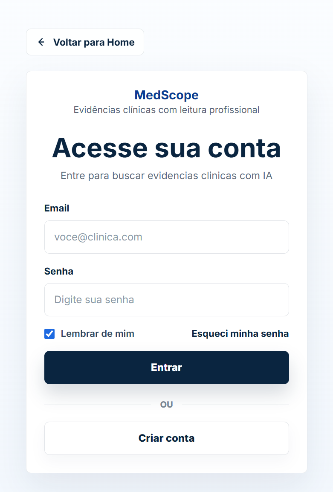
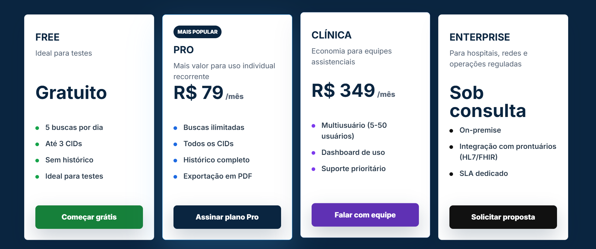
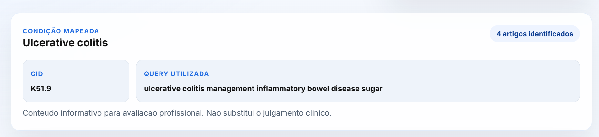
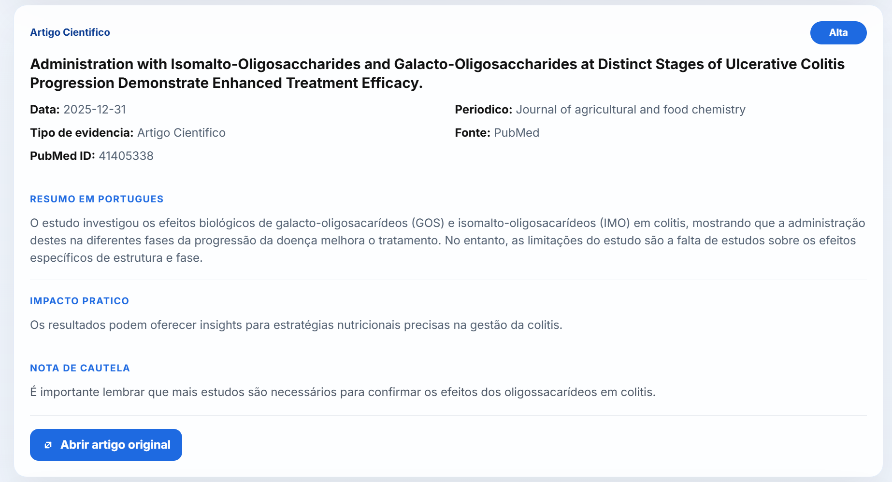
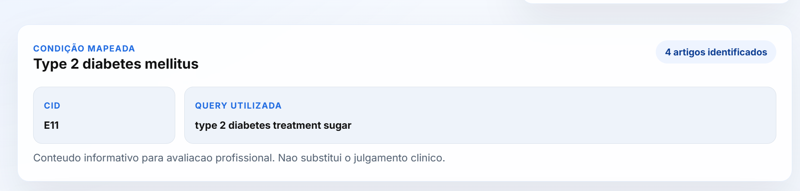
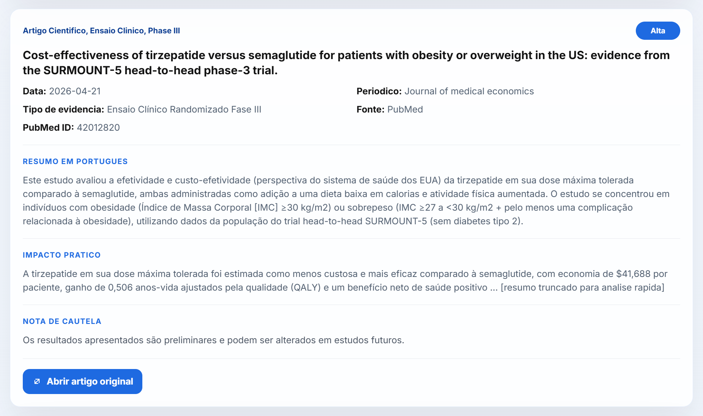

# MedScope

Plataforma healthtech para busca de evidências médicas a partir de CID-10, com resumos científicos em português gerados por IA com base em artigos recentes do PubMed.

O MedScope foi desenhado para reduzir o tempo entre a dúvida clínica e o acesso à literatura relevante, sem substituir o julgamento médico.

## Visão geral

O sistema:

- recebe um CID-10 e um contexto clínico opcional;
- mapeia o CID para uma condição clínica e uma query em inglês;
- consulta artigos recentes no PubMed;
- envia título e abstract para análise local via Ollama;
- devolve resumo em português, classificação de relevância, impacto prático e nota de cautela;
- mantém um disclaimer explícito de uso informacional.

## Destaques do produto

- Busca orientada por CID-10.
- Resumos científicos em português.
- Interface SaaS médica com foco em confiança e clareza.
- Classificação de evidência e relevância.
- Arquitetura full stack com backend Java e frontend Vue.
- IA local via Ollama.

## Interface

### Home


### Login



### Pricing



## Exemplos de busca

### Exemplo 1: `K51.9` -> Ulcerative colitis

Busca e mapeamento da condição:



Resultado estruturado:



### Exemplo 2: `E11` -> Type 2 diabetes mellitus

Busca e mapeamento da condição:



Resultado estruturado:



## Stack

- Backend: Java 21, Spring Boot, Spring Web, Spring Data JPA, Validation e H2.
- Frontend: Vue 3, Vite e Axios.
- Banco de dados: H2.
- IA local: Ollama via HTTP.

## Estrutura do projeto

```text
.
|-- backend
|-- frontend
|-- data
|-- docs
`-- README.md
```

## Seeds iniciais de CIDs

Os CIDs atualmente semeados no projeto são:

- `E11` -> Type 2 diabetes mellitus
- `L40` -> Psoriasis
- `M32` -> Systemic lupus erythematosus
- `J45` -> Asthma
- `K51.9` -> Ulcerative colitis

Esses registros são carregados em [SeedDataConfig.java](backend/src/main/java/com/cliniradar/config/SeedDataConfig.java).

## Requisitos locais

- Java 21
- Maven 3.9+
- Node.js 20+
- Ollama instalado localmente

## Como rodar localmente

### 1. Banco H2

O projeto usa H2 em arquivo local para facilitar testes sem PostgreSQL.

Configuração atual:

```properties
spring.datasource.url=jdbc:h2:file:./data/cliniradar;AUTO_SERVER=TRUE
spring.datasource.driver-class-name=org.h2.Driver
spring.datasource.username=sa
spring.datasource.password=
spring.h2.console.enabled=true
spring.h2.console.path=/h2-console
```

O banco é criado automaticamente ao subir o backend.

Console H2:

```text
http://localhost:8080/h2-console
```

JDBC URL no console:

```text
jdbc:h2:file:./data/cliniradar
```

### 2. Subir o Ollama

Instale o Ollama e baixe o modelo configurado:

```bash
ollama pull mistral
ollama run mistral
```

Configuração padrão do backend:

```properties
ollama.base-url=http://localhost:11434
ollama.model=mistral
```

Se quiser trocar o modelo, ajuste [application.properties](backend/src/main/resources/application.properties).

### 3. Rodar o backend

Arquivo principal de configuração:

[application.properties](backend/src/main/resources/application.properties)

```bash
cd backend
mvn spring-boot:run
```

API disponível em:

```text
http://localhost:8080
```

### 4. Rodar o frontend

```bash
cd frontend
npm install
npm run dev
```

Aplicação disponível em:

```text
http://localhost:5173
```

## Endpoint principal

`POST /api/search`

Exemplo de payload:

```json
{
  "cid": "F41.1",
  "context": "resistant adults psychotherapy"
}
```

Exemplo de resposta:

```json
{
  "cid": "F41.1",
  "condition": "Generalized anxiety disorder",
  "queryUsed": "generalized anxiety disorder treatment resistant adults psychotherapy",
  "disclaimer": "Conteúdo informativo para avaliação profissional. Não substitui julgamento clínico.",
  "articles": [
    {
      "pubmedId": "12345678",
      "title": "Example article",
      "publishedAt": "2026-02-11",
      "publicationType": "Randomized Controlled Trial",
      "journal": "Example Journal",
      "url": "https://pubmed.ncbi.nlm.nih.gov/12345678/",
      "summaryPt": "Resumo informativo em português.",
      "relevanceLevel": "ALTO",
      "evidenceType": "Ensaio clínico",
      "practicalImpact": "Impacto prático descrito de forma cautelosa.",
      "warningNote": "Uso apenas informacional para avaliação profissional."
    }
  ]
}
```

## Como o backend funciona

### Fluxo principal

1. O controller recebe `cid` e `context`.
2. O `CidMappingService` resolve a condição e a query base em inglês.
3. Se a busca vier sem contexto clínico, o backend tenta responder pelo cache pré-processado do CID.
4. Se o cache do CID ainda estiver vazio, ele é preenchido sob demanda.
5. Se houver contexto clínico, o `PubMedClient` busca IDs recentes e depois carrega os detalhes dos artigos.
6. O backend trata artigos sem abstract com mensagem explícita de limitação.
7. O `PromptBuilderService` monta um prompt estruturado e cauteloso.
8. O `OllamaClient` envia o prompt e espera JSON.
9. O `SearchService` persiste requests, artigos e summaries e devolve a resposta pronta para a UI.

### Cache automático por CID

O backend possui um scheduler que atualiza, a cada 12 horas, os 2 artigos mais recentes de todos os CIDs cadastrados.
Quando os artigos retornados pelo PubMed já existem e o conteúdo não mudou, o resumo salvo é reaproveitado.
Quando entra um artigo novo ou quando título, abstract ou metadados mudam, o resumo é refeito pela IA local.

Configuração:

```properties
summary-cache.refresh-interval-ms=43200000
summary-cache.initial-delay-ms=30000
```

Com isso, a consulta comum por CID tende a ler apenas o cache, sem acionar a IA em toda requisição.

### Organização do backend

- `controller`: endpoints REST.
- `service`: regras principais da aplicação.
- `repository`: acesso JPA.
- `dto`: payloads de entrada e saída.
- `entity`: modelos persistidos.
- `client`: integrações externas com PubMed e Ollama.
- `exception`: tratamento global de erros.

## Observações de negócio

- O sistema não recomenda tratamento.
- O sistema não afirma conduta médica.
- Os resumos devem ser lidos como apoio informacional.
- Quando a evidência for fraca ou inconclusiva, isso deve aparecer no resumo e na nota de cautela.
- Toda resposta inclui disclaimer para avaliação profissional.

## Pontos de atenção

- O PubMed pode retornar artigos sem abstract; nesses casos, o backend informa a limitação explicitamente.
- O Ollama precisa estar respondendo em `http://localhost:11434`.
- O modelo escolhido deve conseguir seguir instruções e retornar JSON válido.
- `ddl-auto=update` foi usado para facilitar o MVP.

## Melhorias futuras

- Cache de resultados por query.
- Suporte a mais CIDs e importação de uma tabela maior.
- Autenticação e histórico por usuário.
- Filtros por ano, tipo de estudo e especialidade.
- Testes automatizados de integração com mocks de PubMed e Ollama.
